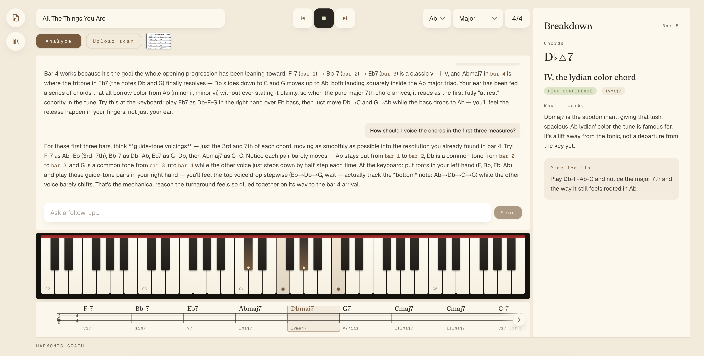

# Harmonic Coach

**An AI lead-sheet tutor for harmonic understanding.**

Harmonic Coach helps piano students understand chord charts measure by measure. Users can enter a lead sheet, select a specific measure, and receive piano-instructor-style harmonic analysis including chord function, confidence level, practice tips, and alternative interpretations.

## Features

- **Polished Frontend UI**: Single-page app with warm, musical design
- **Lead-Sheet Editor**: Grid of editable measure cards with chord inputs
- **Song Metadata**: Configure title, key, and time signature
- **AI Harmonic Analysis**: One click sends the whole chart to Claude, which returns a structured per-measure breakdown (function, roman numeral, confidence, practice tip, alternative hearings)
- **Measure Timeline**: Sticky bottom timeline with one cell per bar, color-coded by harmonic function, synced with measure selection
- **Follow-up Q&A with Coach**: Ask Claude follow-up questions about specific measures with conversational history, suggestion chips for quick starters, and persistent chat thread
- **Demo Fallback**: Hardcoded analysis for the demo progression when no AI analysis has run
- **Responsive Design**: Sticky analysis panel on desktop, responsive layout on mobile
- **Measure Selection**: Click to select, edit without losing state, add new measures


## Follow-up Q&A with the Coach

After analyzing a lead sheet, you can ask Claude follow-up questions about specific measures. The Coach maintains conversation context and remembers the chart structure.

**Features:**
- **Conversational History**: Chat thread persists across sessions via localStorage
- **Smart Suggestions**: Quick-start suggestion chips appear for common follow-up questions
- **Measure Context**: Click `[bar N]` links in responses to jump to that measure
- **Adaptive Thinking**: Claude uses reasoning to provide deeper musical insights
- **Session Persistence**: Entire Q&A thread saved with your song session

**Example questions:**
- "How should I voice the chords in the first three measures?"
- "What's a good left-hand voicing for this progression?"
- "Why does this chord work here?"
- "Can you suggest an alternative to measure 5?"



## Getting Started

### Prerequisites
- Node.js 18+
- npm

### Installation & Development

```bash
npm install
npm run dev
```

Open [http://localhost:3000](http://localhost:3000) in your browser. The app will reload as you make changes.

### AI Analysis Setup

The "Analyze with Claude" feature calls the Anthropic API from a Next.js route handler. Create a `.env.local` file in the project root:

```bash
ANTHROPIC_API_KEY=sk-ant-...
```

Restart the dev server after adding the key. Without it, the app still runs — analysis requests return a friendly error and the demo fallback analysis remains available.

### Linting

```bash
npm run lint
```
